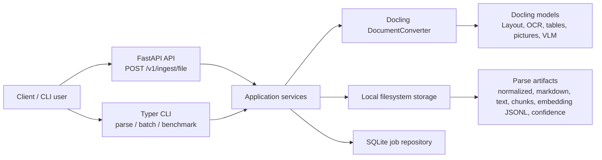
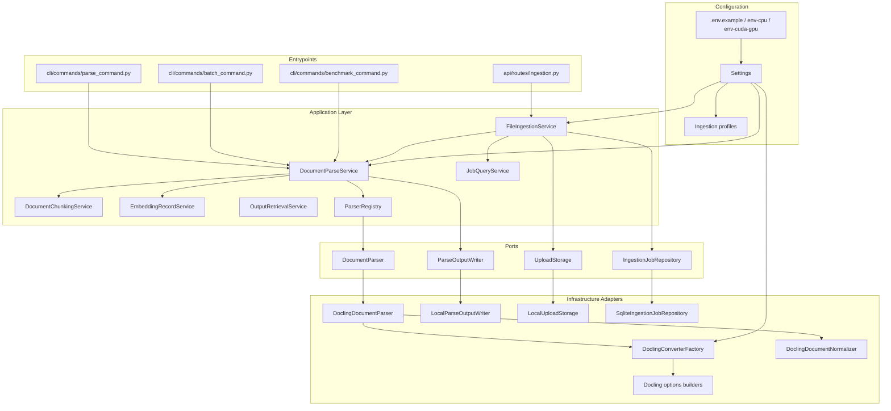
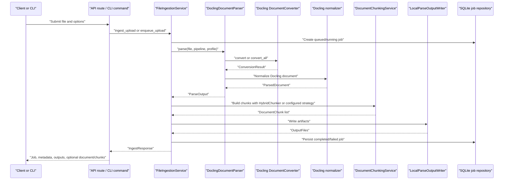
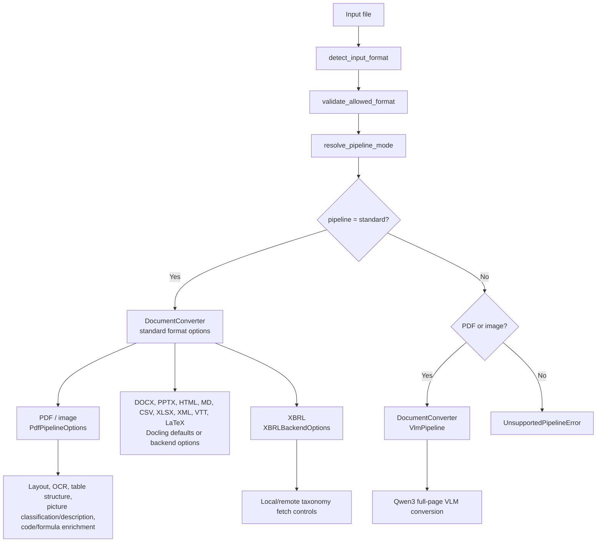
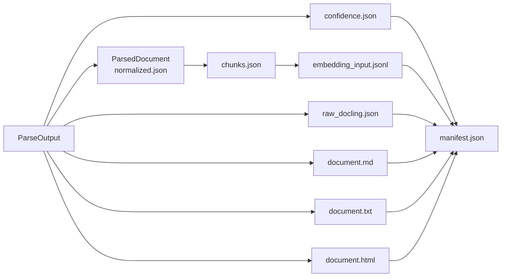
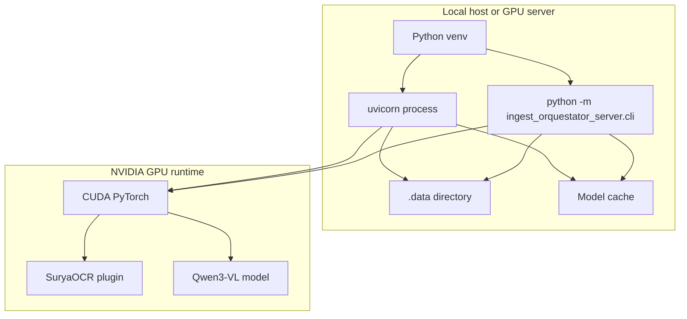

# Architecture Diagram

This page describes the service architecture with Mermaid diagrams.

## System Context

## Component View

## Ingestion Sequence

## Docling Pipeline Routing

## Output Model

## Deployment View

