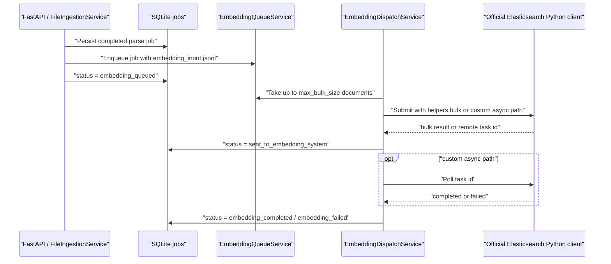

# Embedding Handoff

v1.4 adds an optional local queue for sending parsed documents to a remote
embedding system after ingestion has produced `embedding_input.jsonl`.

The queue is intentionally process-local for the MVP. It does not require
Redis, Celery, Kafka, or another queue service. If the API process restarts,
queued in-memory items are lost, but persisted jobs and output artifacts remain
available and can be re-dispatched.

## Flow



## Statuses

| Status | Meaning |
| --- | --- |
| `embedding_queued` | Parsed output has been written and the document is waiting in the local embedding queue. |
| `sent_to_embedding_system` | A batch was accepted by the official Elasticsearch client. Bulk mode records an internal `elastic-bulk:*` marker; custom async mode records the remote task id. |
| `embedding_task_running` | The document is being prepared for remote submission. |
| `embedding_completed` | The remote task reported completion. |
| `embedding_failed` | Submit or remote task polling failed. |

## Configuration

Enable the queue and configure the remote endpoint with local environment
variables:

```bash
export INGEST_EMBEDDING_QUEUE_ENABLED=true
export INGEST_EMBEDDING_QUEUE_MAX_BULK_SIZE=5
export INGEST_EMBEDDING_ELASTIC_URL="https://your-elastic-endpoint:9200"
export INGEST_EMBEDDING_ELASTIC_USERNAME="your-user"
export INGEST_EMBEDDING_ELASTIC_PASSWORD="your-password"
export INGEST_EMBEDDING_ELASTIC_INDEX="open-rag-embeddings-v2"
export INGEST_EMBEDDING_ELASTIC_MAPPING_VERSION="v2"
export INGEST_EMBEDDING_ELASTIC_PIPELINE=
export INGEST_EMBEDDING_ELASTIC_SUBMIT_PATH="/_bulk"
export INGEST_EMBEDDING_ELASTIC_TASK_ID_FIELD="task"
export INGEST_EMBEDDING_ELASTIC_TASK_STATUS_PATH_TEMPLATE="/_tasks/{task_id}"
```

Do not commit real credentials. The checked-in env files contain placeholders
only.

## Elasticsearch Client Contract

v1.4.5 uses the official `elasticsearch` 9.x Python client to connect to your
Elasticsearch 9.3 cluster. When `INGEST_EMBEDDING_ELASTIC_SUBMIT_PATH=/_bulk`,
the dispatcher uses `elasticsearch.helpers.bulk` and sends one Elasticsearch
document per `embedding_input.jsonl` record. In practice, every normalized RAG
chunk is indexed as a unique document with `_id = record_id`. This mode is
synchronous: once bulk indexing returns successfully, the internal task marker
is considered complete.

For a custom async embedding endpoint, set
`INGEST_EMBEDDING_ELASTIC_SUBMIT_PATH` to that endpoint. The service then
expects the submit response to return a task id. The field is controlled by
`INGEST_EMBEDDING_ELASTIC_TASK_ID_FIELD`, which supports dotted paths such as
`task.id`.

Example submit response:

```json
{
  "task": "node-1:12345"
}
```

Plain Elasticsearch `_bulk` indexing does not return a remote task id. The
service records a deterministic local `elastic-bulk:*` marker for observability
and moves the job to `embedding_completed` after the official bulk helper
returns without item errors. For a true remote async workflow, point
`INGEST_EMBEDDING_ELASTIC_SUBMIT_PATH` at the endpoint that creates the
embedding task.

The remote payload uses the existing `embedding_input.jsonl` records as source
of truth. Each indexed chunk document contains:

- `record_id`, `document_id`, and `chunk_id` for deterministic identity.
- `content` and `title` as normal text fields.
- For `INGEST_EMBEDDING_ELASTIC_MAPPING_VERSION=v1`, `content` and `title` are
  sent through the configured ingest pipeline to populate `content_embedding`
  and `title_embedding`.
- For `INGEST_EMBEDDING_ELASTIC_MAPPING_VERSION=v2`, `content_semantic` and
  `title_semantic` are also populated for the `semantic_text` fields. The
  dispatcher does not attach an ingest pipeline in this mode because inference
  is configured by the field mapping.
- Filterable metadata fields such as `source_file_name`, `input_format`,
  `parser`, `pipeline`, `chunker_strategy`, page span, element ids,
  element types, VLM/picture-description runtime fields, and confidence scores.
- The original per-record `metadata` object for traceability.

By default, `metadata.source_path` is removed before dispatch so local
filesystem paths are not sent outside the service. Set
`INGEST_EMBEDDING_ELASTIC_INCLUDE_LOCAL_PATHS=true` only when the remote system
explicitly needs those paths.

## Elasticsearch Index Assets

The repository includes two ready-to-apply Elasticsearch 9.x assets:

- `elastic/open-rag-embeddings-v1.json`: dense-vector fields plus
  `qwen3_embeddings_pipeline`.
- `elastic/open-rag-embeddings-v2.json`: `semantic_text` fields
  `content_semantic` and `title_semantic`, with automatic chunking disabled
  because this service already sends one pre-chunked RAG record per indexed
  document.

Use v2 with:

```bash
export INGEST_EMBEDDING_ELASTIC_INDEX=open-rag-embeddings-v2
export INGEST_EMBEDDING_ELASTIC_MAPPING_VERSION=v2
export INGEST_EMBEDDING_ELASTIC_PIPELINE=
```

Apply the v2 mapping with:

```bash
jq '.index' elastic/open-rag-embeddings-v2.json \
  | curl -k -u "$INGEST_EMBEDDING_ELASTIC_USERNAME:$INGEST_EMBEDDING_ELASTIC_PASSWORD" \
      -H 'Content-Type: application/json' \
      -X PUT "$INGEST_EMBEDDING_ELASTIC_URL/open-rag-embeddings-v2" \
      -d @-
```

Use v1 with:

```bash
export INGEST_EMBEDDING_ELASTIC_INDEX=open-rag-embeddings-v1
export INGEST_EMBEDDING_ELASTIC_MAPPING_VERSION=v1
export INGEST_EMBEDDING_ELASTIC_PIPELINE=qwen3_embeddings_pipeline
```

Apply the v1 mapping and pipeline with:

```bash
jq '.index' elastic/open-rag-embeddings-v1.json \
  | curl -k -u "$INGEST_EMBEDDING_ELASTIC_USERNAME:$INGEST_EMBEDDING_ELASTIC_PASSWORD" \
      -H 'Content-Type: application/json' \
      -X PUT "$INGEST_EMBEDDING_ELASTIC_URL/open-rag-embeddings-v1" \
      -d @-

jq '.pipeline' elastic/open-rag-embeddings-v1.json \
  | curl -k -u "$INGEST_EMBEDDING_ELASTIC_USERNAME:$INGEST_EMBEDDING_ELASTIC_PASSWORD" \
      -H 'Content-Type: application/json' \
      -X PUT "$INGEST_EMBEDDING_ELASTIC_URL/_ingest/pipeline/qwen3_embeddings_pipeline" \
      -d @-
```

The mapping keeps the user-facing chunk metadata queryable while storing the
full raw metadata object in `_source` without dynamically expanding mappings.
The vector field is configured for 4096 dimensions with `int8_hnsw` indexing.
Because `dot_product` expects unit-length float vectors, keep this setting only
if the deployed Qwen3 embedding endpoint returns normalized vectors. Otherwise,
use `cosine` similarity or normalize vectors before indexing.

## Public API Contract

The queue is internal to ingestion. There are no public queue API endpoints.

The external flow remains:

```text
POST /v1/ingest/file
-> parser selected by request/config
-> normalized document, chunks, embedding_input.jsonl
-> internal embedding queue
-> Elasticsearch Python client bulk/custom async handoff
```

Use the existing job endpoint to observe the current document state:

```bash
curl "http://127.0.0.1:8000/v1/ingest/jobs/{job_id}"
```

When ingestion runs through the API and the queue is enabled, the API schedules
an in-process background drain loop after the parse finishes. The drain loop
polls an active task first. When no active task is running, it submits the next
batch of up to `INGEST_EMBEDDING_QUEUE_MAX_BULK_SIZE` documents.

Local storage remains the canonical per-document artifact store. Elasticsearch
receives one indexed document per RAG chunk, but the original upload,
`normalized.json`, `chunks.json`, `embedding_input.jsonl`, and related artifacts
remain available through the job output API until local retention removes them.
