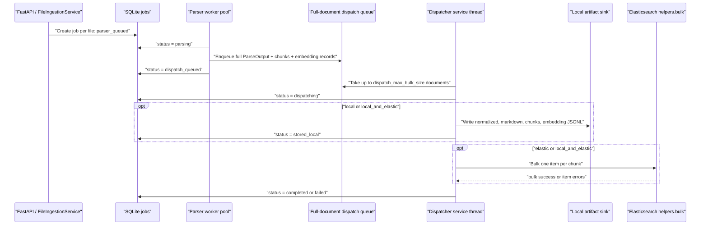

# Dispatch Handoff

v1.5 makes the queue mandatory. The API no longer parses or stores documents in
the request path. Each uploaded file creates a persisted job, parser workers
produce a full parsed document result, and the dispatcher decides whether to
store local artifacts, index Elastic documents, or do both.

The queue is process-local for the MVP. It does not require Redis, Celery,
Kafka, or another queue service. Persisted job state is used for status
visibility and startup recovery.

## Flow



## Statuses

| Status | Meaning |
| --- | --- |
| `parser_queued` | The upload is stored and waiting for a parser worker. |
| `parsing` | A parser worker is running Docling or another parser. |
| `parsed` | Parser output exists in memory and is ready to enter the dispatch queue. |
| `dispatch_queued` | The full parsed result is waiting for the dispatcher. |
| `dispatching` | The dispatcher selected the document for the current batch. |
| `stored_local` | Local artifacts were written successfully. |
| `indexed_elastic` | Reserved for Elastic-only progress reporting. |
| `retryable_failure` | A queue or dispatch failure can be retried by recovery or operator action. |
| `completed` | All configured sinks finished successfully. |
| `failed` | Parsing, local storage, or Elastic dispatch failed after retry handling. |

## Configuration

```bash
export INGEST_PARSER_WORKER_COUNT=2
export INGEST_DISPATCH_QUEUE_MAX_SIZE=100
export INGEST_DISPATCH_QUEUE_MAX_PAYLOAD_BYTES=
export INGEST_DISPATCH_MAX_BULK_SIZE=5
export INGEST_DISPATCH_IDLE_INTERVAL_SECONDS=0.5
export INGEST_DISPATCH_SINK_MODE=local
export INGEST_DISPATCH_MAX_RETRIES=3
export INGEST_DISPATCH_RETRY_BACKOFF_SECONDS=1
export INGEST_EMBEDDING_ELASTIC_URL="https://your-elastic-endpoint:9200"
export INGEST_EMBEDDING_ELASTIC_USERNAME="your-user"
export INGEST_EMBEDDING_ELASTIC_PASSWORD="your-password"
export INGEST_EMBEDDING_ELASTIC_INDEX="open-rag-embeddings-v2"
export INGEST_EMBEDDING_ELASTIC_MAPPING_VERSION="v2"
export INGEST_EMBEDDING_ELASTIC_PIPELINE=
```

`INGEST_DISPATCH_SINK_MODE` accepts:

- `local`: write local artifacts only.
- `elastic`: index Elastic chunk documents only.
- `local_and_elastic`: do both.

Do not commit real credentials. The checked-in env files contain placeholders
only.

## Elasticsearch Contract

The dispatcher uses the official `elasticsearch` 9.x Python client and
`elasticsearch.helpers.bulk`. Queue items are full parsed documents, not chunk
records. The dispatcher generates one Elastic bulk action per RAG chunk and
uses deterministic `_id = record_id` so retries are idempotent.

`INGEST_DISPATCH_QUEUE_MAX_SIZE` bounds queue depth. Set
`INGEST_DISPATCH_QUEUE_MAX_PAYLOAD_BYTES` when the process should reject a
single oversized parsed document instead of keeping a very large in-memory
payload. The MVP queue is still process-local; for multi-process API servers or
hard durability across restarts, replace it with an external queue or persisted
spool in a future version.

For `INGEST_EMBEDDING_ELASTIC_MAPPING_VERSION=v1`, the dispatcher sends
`content` and `title` through the configured ingest pipeline to populate
`content_embedding` and `title_embedding`.

For `INGEST_EMBEDDING_ELASTIC_MAPPING_VERSION=v2`, the dispatcher also sends
`content_semantic` and `title_semantic` for the `semantic_text` fields. It does
not attach an ingest pipeline in this mode because inference is configured by
the field mapping.

By default, `metadata.source_path` is removed before dispatch so local
filesystem paths are not sent outside the service. Set
`INGEST_EMBEDDING_ELASTIC_INCLUDE_LOCAL_PATHS=true` only when the remote system
explicitly needs those paths.

## Public API Contract

The queue is internal to ingestion. There are no public queue API endpoints.

```text
POST /v1/ingest/file or /v1/ingest/files
-> job DB row per file
-> parser worker pool
-> mandatory full-document dispatch queue
-> dispatcher-owned local storage and/or Elastic bulk indexing
```

Use the job endpoint to observe state:

```bash
curl "http://127.0.0.1:8000/v1/ingest/jobs/{job_id}"
```

Local storage remains the canonical per-document artifact store when the local
sink is enabled. Elasticsearch receives one indexed document per RAG chunk.
